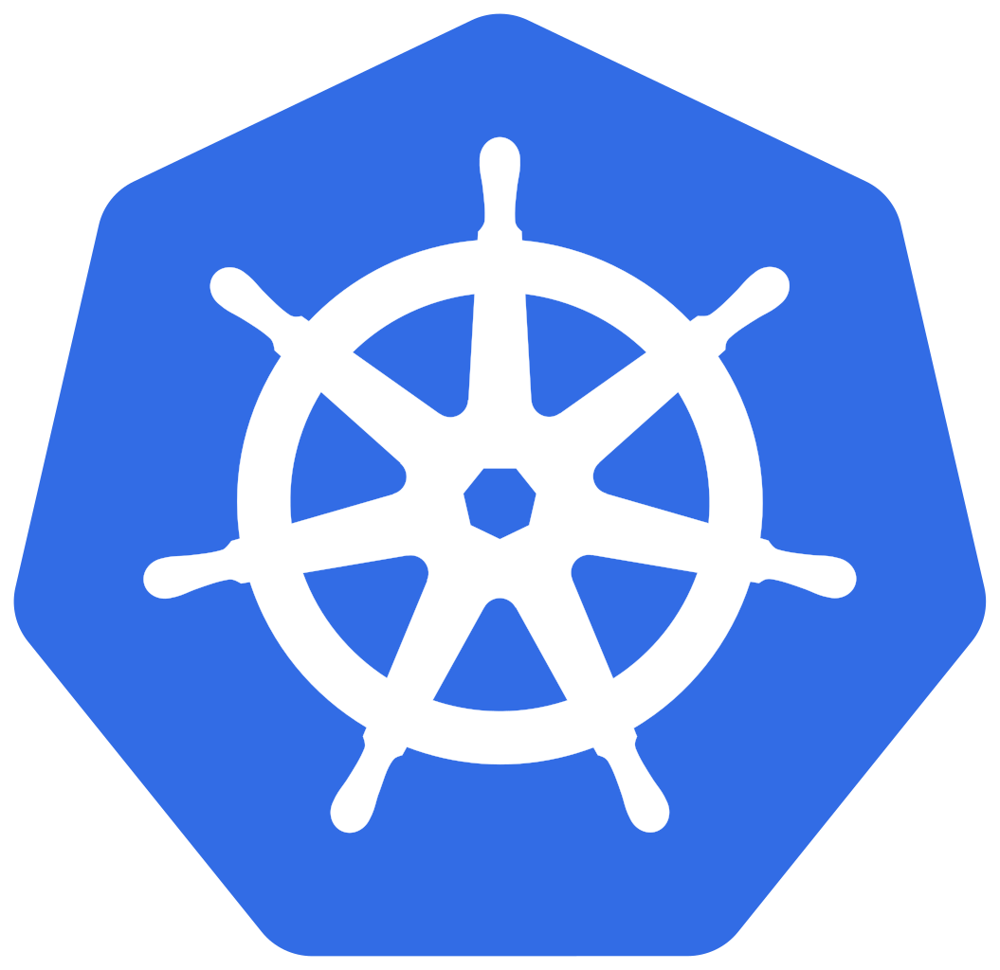
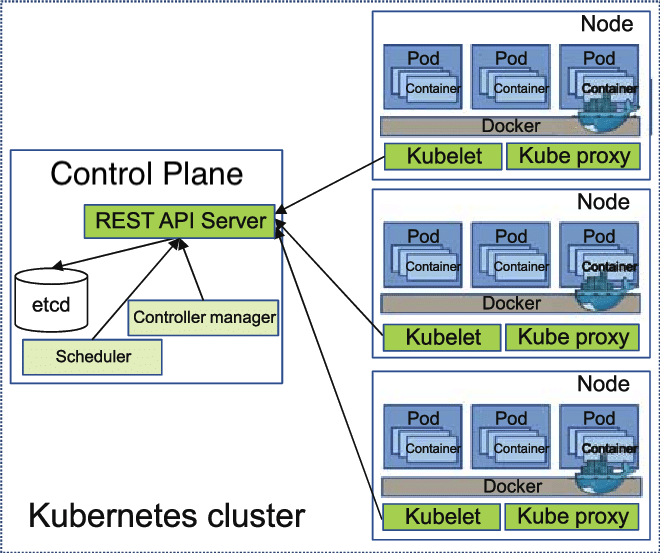
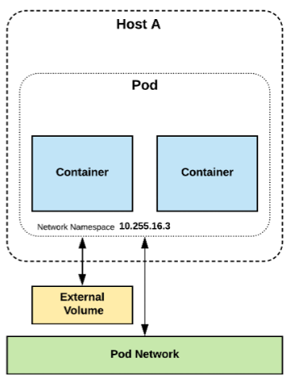
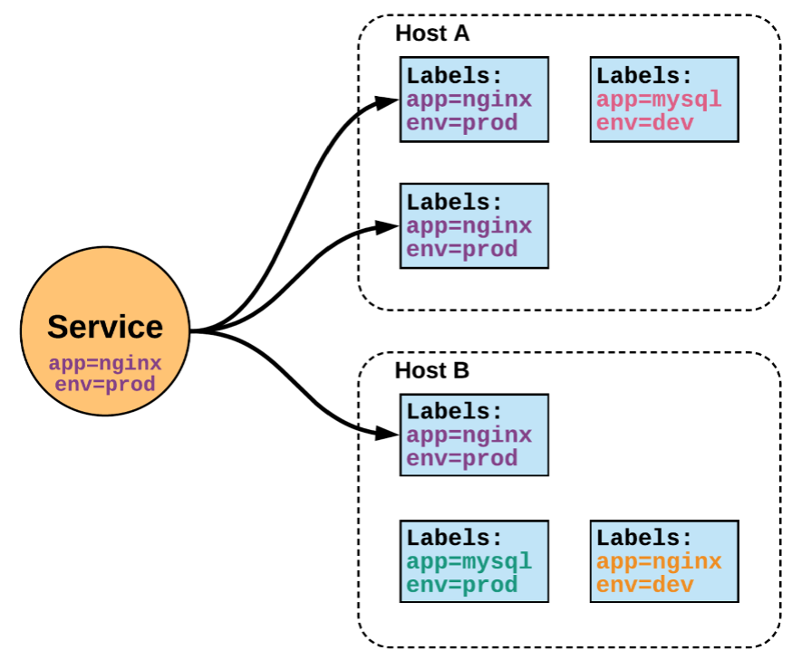

# Kubernetes

- Kubernetes is a container management system

- It runs and manages containerized applications on a cluster

- What does that really mean?



---

# What can we do with Kubernetes?

- Let's imagine that we have a 3-tier hotel booking app:

  - web frontend

  - API backend

  - database (that we will keep out of Kubernetes for now)

- We have built images for our frontend and backend components

  (e.g. with Dockerfiles and docker build)

- We are running them successfully with a local environment

  (e.g. with Docker Compose)

- Let's see how we would deploy our app on Kubernetes!

---

# Basic things we can ask Kubernetes to do

- Start 5 containers using image `hotelapp/profile`

- Place an internal load balancer in front of these containers

- Start 10 containers using image `hotelapp/frontend`

- Place a public load balancer in front of these containers

- It's summertime, traffic spikes, grow our cluster and add containers

- New release! Replace my containers with the new image `hotelapp/frontend`

- Keep processing requests during the upgrade; update my containers one at a time

---

# Other things that Kubernetes can do for us

- Basic autoscaling

- Blue/green deployment, canary deployment

- Long running services, but also batch (one-off) jobs

- Overcommit our cluster and evict low-priority jobs

- Run services with stateful data (databases etc.)

- Fine-grained access control defining what can be done by whom on which resources

- Integrating third party services (service catalog)

- Automating complex tasks (operators)

---

# Kubernetes Architecture

---


---

# Kubernetes architecture

- Ha ha ha ha

- OK, I was trying to scare you, it's much simpler than that ❤️

---



---

# Kubernetes architecture: the nodes

- The nodes executing our containers run a collection of services:

  - a container Engine (typically Docker)

  - kubelet (the "node agent")

  - kube-proxy (a necessary but not sufficient network component)

- Nodes were formerly called "minions"

  (You might see that word in older articles or documentation)

---

# Kubernetes architecture: the control plane

- The Kubernetes logic (its "brains") is a collection of services:

  - the API server (our point of entry to everything!)

  - core services like the scheduler and controller manager

  - etcd (a highly available key/value store; the "database" of Kubernetes)

- Together, these services form the control plane of our cluster

- The control plane is also called the "master"

---

# Interacting with Kubernetes

- We will interact with our Kubernetes cluster through the Kubernetes API

- The Kubernetes API is (mostly) RESTful

- It allows us to create, read, update, delete resources

- A few common resource types are:

- node (a machine — physical or virtual — in our cluster)

  - pod (group of containers running together on a node)

  - service (stable network endpoint to connect to one or multiple containers)

---

# Pod

<div class="columns">

<div>

- Atomic unit or smallest “unit of work” of Kubernetes

- One or MORE containers that share volumes, a network namespace, and are a part of a single context

<br>

* **Pods are Ephemeral!**

</div>

<div>



</div>

</div>

---

# Service

<div class="columns">

<div>

- Unified method of accessing the exposed workloads of Pods

- Durable resource

  - static cluster IP

  - static namespaced DNS name


<br>

* **Services are NOT Ephemeral!**

</div>

<div>



</div>

</div>

---

# Connecting to our Kubernetes cluster

- Our cluster has multiple nodes named `kube1`, `kube2`, etc.

- We will do everything from `kube1`

- We have SSH access to the other nodes, but won't need it

  (but we can use it for debugging, troubleshooting, etc.)

---

# First contact with kubectl

- `kubectl` is (almost) the only tool we'll need to talk to Kubernetes

- It is a rich CLI tool around the Kubernetes API

  (Everything you can do with `kubectl`, you can do directly with the API)

- On our machines, there is a `~/.kube/config` file with:

  - the Kubernetes API address

  - the path to our TLS certificates used to authenticate

- You can also use the `--kubeconfig` flag to pass a config file

- Or directly `--server`, `--user`, etc.

---

# `kubectl` is the new SSH

- We often start managing servers with SSH

  (installing packages, troubleshooting ...)

- At scale, it becomes tedious, repetitive, error-prone

- Instead, we use config management, central logging, etc.

- In many cases, we still need SSH:

  - as the underlying access method (e.g. Ansible)

  - to debug tricky scenarios

  - to inspect and poke at things

---

# `kubectl get`

Let's look at our `Node` resources with `kubectl get`!

- Log into `kube1`

- Check that all nodes are `Ready`:

  ```bash
  kubectl get nodes
  ```

---

# Running our first containers on Kubernetes

- First things first: we cannot run a container

- We are going to run a pod, and in that pod there will be a single container

- In that container in the pod, we are going to run a simple `ping` command

---

# Starting a simple pod with `kubectl run`

- `kubectl run` is convenient to start a single pod

- We need to specify at least a *name* and the *image* we want to use

- Optionally, we can specify the command to run in the pod

- Let's ping the address of `localhost`, the loopback interface:

  ```bash
  kubectl run webserver --image alpine ping 127.0.0.1
  ```
  The output tells us that a Pod was created:

  ```
  $ pod/webserver created
  ```

---

# Viewing container output

- Let's use the `kubectl logs` command

- It takes a Pod name as argument

- Unless specified otherwise, it will only show logs of the first container in the pod

  (Good thing there's only one in ours!)

- View the result of our ping command:

  ```
  kubectl logs webserver
  ```

---

# Scaling our application

- `kubectl` gives us a simple command to scale a workload:

  `kubectl scale TYPE NAME --replicas=HOWMANY`

- Let's try it on our Pod, so that we have more Pods!

- Try to scale the Pod:

  ```
  kubectl scale pod webserver --replicas=3
  ```

  &nbsp;  
  🤔 We get the following error, what does that mean?

  <span style="font-size: 26px">`Error from server (NotFound): the server could not find the requested resource`</span>

---
# Scaling a Pod

- We cannot "scale a Pod"

  (that's not completely true; we could give it more CPU/RAM)

- If we want more Pods, we need to create more Pods

  (i.e. execute kubectl run multiple times)

- There must be a better way!

  (spoiler alert: yes, there is a better way!)

---

# Creating more pods

- We are going to create a ReplicaSet

  (= set of replicas = set of identical pods)

- In fact, we will create a Deployment, which itself will create a ReplicaSet

- Why so many layers? We'll explain that shortly, don't worry!

---

# Creating a Deployment running `ping`

- Let's create a Deployment instead of a single Pod
- Create the Deployment; pay attention to the --:

  ```
  kubectl create deployment webserver --image=alpine -- ping 127.0.0.1
  ```

- The `--` is used to separate:

  - "options/flags of kubectl create

  - command to run in the container

---

# What has been created?

- Check the resources that were created:

  ```
  kubectl get all
  ```

Note: kubectl get all is a lie. It doesn't show everything.

(But it shows a lot of "usual suspects", i.e. commonly used resources.)

---

# There's a lot going on here!

```
NAME                           READY   STATUS    RESTARTS   AGE
pod/webserver                   1/1     Running   0          33s
pod/webserver-fc7cf666d-5chdk   1/1     Running   0          7s

NAME                       READY   UP-TO-DATE   AVAILABLE   AGE
deployment.apps/webserver   1/1     1            1           8s

NAME                                 DESIRED   CURRENT   READY   AGE
replicaset.apps/webserver-fc7cf666d   1         1         1       8s
```

Our new Pod is not named `webserver`, but `webserver-xxxxxxxxxxx-yyyyy`.`

We have a Deployment named `webserver`, and an extra `ReplicaSet`, too. What's going on?

---

# From Deployment to Pod

We have the following resources:

- `deployment.apps/webserver`

  This is the Deployment that we just created.

- `replicaset.apps/webserver-xxxxxxxxxx`

  This is a Replica Set created by this Deployment.

- `pod/webserver-xxxxxxxxxx-yyyyy`

  This is a *pod* created by the Replica Set.

Let's explain what these things are.

---

# Pod

- Can have one or multiple containers

- Runs on a single node

  (Pod cannot "straddle" multiple nodes)

- Pods cannot be moved

  (e.g. in case of node outage)

- Pods cannot be scaled horizontally

  (except by manually creating more Pods)

---

# Pod details

- A Pod is not a process; it's an environment for containers

  - it cannot be "restarted"

  - it cannot "crash"

- The containers in a Pod can crash

- They may or may not get restarted

  (depending on Pod's restart policy)

- If all containers exit successfully, the Pod ends in "Succeeded" phase

- If some containers fail and don't get restarted, the Pod ends in "Failed" phase

---

# Replica Set

- Set of identical (replicated) Pods

- Defined by a pod template + number of desired replicas

- If there are not enough Pods, the Replica Set creates more

  (e.g. in case of node outage; or simply when scaling up)

- If there are too many Pods, the Replica Set deletes some

  (e.g. if a node was disconnected and comes back; or when scaling down)

- We can scale up/down a Replica Set

  - we update the manifest of the Replica Set

  - as a consequence, the Replica Set controller creates/deletes Pods

---

# Deployment

- Replica Sets control identical Pods

- Deployments are used to roll out different Pods

  (different image, command, environment variables, ...)

- When we update a Deployment with a new Pod definition:

  - a new Replica Set is created with the new Pod definition

  - that new Replica Set is progressively scaled up

  - meanwhile, the old Replica Set(s) is(are) scaled down

- This is a *rolling update*, minimizing application downtime

- When we scale up/down a Deployment, it scales up/down its Replica Set

---

# Can we scale now?

- Let's try kubectl scale again, but on the Deployment!

- Scale our webserver deployment:

  ```
  kubectl scale deployment webserver --replicas 3
  ```

- Note that we could also write it like this:

  ```
  kubectl scale deployment/webserver --replicas 3
  ```

- Check that we now have multiple pods:

  ```
  kubectl get pods
  ```

---

# Resilience

- The *deployment* `webserver` watches its replica set

- The *replica set* ensures that the right number of pods are running

- What happens if pods disappear?

- In a separate window, watch the list of pods:
  
  ```
  watch kubectl get pods
  ```

- Destroy the pod currently shown by kubectl logs:

  ```
  kubectl delete pod webserver-xxxxxxxxxx-yyyyy
  ```

---

# What happened?

- `kubectl delete pod` terminates the pod gracefully

  (sending it the TERM signal and waiting for it to shutdown)

- As soon as the pod is in "Terminating" state, the Replica Set replaces it

- But we can still see the output of the "Terminating" pod in `kubectl logs`

- Until 30 seconds later, when the grace period expires

- The pod is then killed, and `kubectl logs` exits

---

# Deleting a standalone Pod

- What happens if we delete a standalone Pod?

  (like the first webserver Pod that we created)

- Delete the Pod:

  ```
  kubectl delete pod webserver
  ```

- No replacement Pod gets created because there is no controller watching it

- That's why we will rarely use standalone Pods in practice

  (except for e.g. punctual debugging or executing a short supervised task)

---

# Labels and selectors

- Grouping primitives that allow logical operation on objects in Kubernetes

---

# Labels

- Labels are key/value pairs attached to objects

- Labels can be added, removed, changed, dynamically

---

# Viewing labels for our Deployment

- Let's look up the Deployment that was created 

  ```
  kubectl describe deployment webserver
  ```

- We see one label:

  `Labels: app=webserver`

- This is added by `kubectl create deployment`

---

# And for the related Pod?

- Let's look up the Pod that was created and check it too

  ```
  kubectl describe pod webserver-xxxxxxxxxx-yyyyy
  ```

- We see two labels:

  ```
  Labels: app=webserver
          pod-template-hash=xxxxxxxxxx
  ```

- `app=webserver` comes from `kubectl create deployment` too

- `pod-template-hash` was assigned by the Replica Set

---

# Selectors

- A *selector* is an expression matching labels

- It will restrict a command to the objects matching at least all these labels

- List all the pods with at least `app=webserver`:

  ```
  kubectl get pods --selector=app=webserver
  ```

- List all the pods with a label `app`, regardless of its value:

  ```
  kubectl get pods --selector=app
  ```

---

# Setting labels

- The easiest method is to use `kubectl label`

- Set a label on the `webserver` Deployment:

  ```
  kubectl label deployment webserver version=v1
  ```

- Check it out:

  ```
  kubectl describe deployment webserver
  ```

---

# More on selectors

- If a selector has multiple labels, it means "match at least these labels"

  Example: `--selector=app=frontend,release=prod`

- `--selector` can be abbreviated as `-l` (for labels)

- We can also use negative selectors

  Example: --selector=app!=clock

- Selectors can be used with most `kubectl` commands

  Examples: `kubectl delete`, `kubectl label`, ...

---

# Other ways to view labels

- We can use the `--show-labels` flag with `kubectl get`

- List all the labels that we have on pods:

  ```
  kubectl get pods --show-labels
  ```

---

# Services

---

# Exposing services: Internal access

ClusterIP: Internal Access Only
- Most basic service type
- Exposes app via internal IP (not reachable externally)
- Load balances traffic across matching pods

```bash
Copy
Edit
kubectl expose deployment webserver \
  --port=8080 \
  --target-port=80
```

Kubernetes defaults to `ClusterIP` if no `--type` is specified.

---
# Verifying the ClusterIP service

Run this:

```bash
kubectl get services
```

Sample output:

```
NAME        TYPE        CLUSTER-IP       EXTERNAL-IP   PORT(S)     AGE
webserver   ClusterIP   10.96.132.157    <none>        8080/TCP    5s
```

Internal IP now balances traffic across all webserver pods.

---

# Testing internally with a curl pod

Create a temporary pod that can reach the service:

```bash
kubectl run curl \
  --image=curlimages/curl \
  -it --restart=Never -- sh
```

Inside the pod:

```bash
curl webserver:8080
```

You should see the Nginx welcome page HTML

---

# Exposing services: External access

To expose the deployment publicly, use a NodePort service:

```bash
kubectl expose deployment webserver \
  --port=8080 \
  --target-port=80 \
  --type=NodePort \
  --name=webserver-nodeport
```

---

# Verifying the NodePort service

Run this:

```bash
kubectl get services
```

Sample output:

```
NAME                 TYPE       CLUSTER-IP       PORT(S)          AGE
webserver            ClusterIP  10.96.132.157    8080/TCP         2m
webserver-nodeport   NodePort   10.96.142.201    8080:31234/TCP   10s
```

- 31234 is a randomly chosen port on each node
- Still forwards to port 80 in the pod

---

# Accessing the app externally

Use the node’s IP and the `NodePort`:

```bash
curl http://<node-ip>:31234
```
